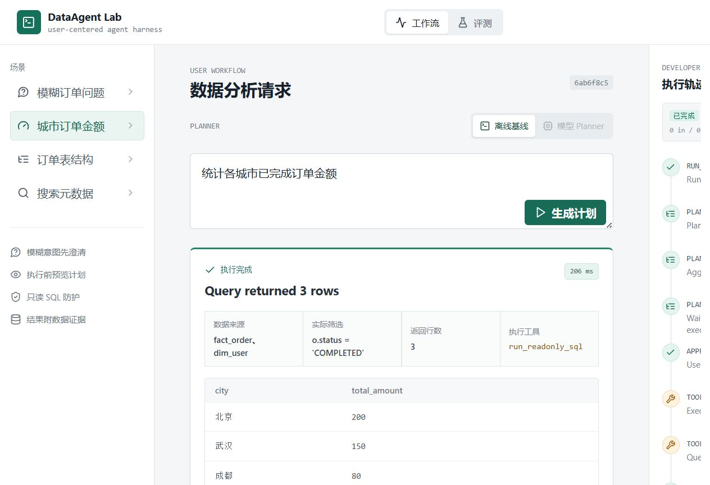

# DataAgent Lab

DataAgent Lab 是一个面向数据开发工作流的可复现智能体执行框架。
它专注于受控的工具调用、安全性、可观测性和评测，而不依赖私有企业数据集或特定模型供应商。



## 已实现功能

- 后端采用 Java 17 + Spring Boot 3，前端采用 Vue 3 + TypeScript。
- 基于注册表管理工具，运行时与模型提示词共享 JSON 输入模式。
- 支持元数据搜索、表结构查看和只读 SQL 执行。
- 使用 JSqlParser 进行校验，强制执行单条语句，并自动添加 `LIMIT 200` 防护。
- 从规划到工具执行均使用明确的运行状态和结构化 Trace 事件。
- Run 状态、Trace、已执行工具、证据、反馈和待审批 Plan 持久化到 MySQL，服务重启后仍可查询历史或继续审批。
- Agent 内部持久化表不会进入业务元数据目录；SQL 校验层只允许查询目录内物理表，并禁止跨 Schema 查询。
- 用户工作流会澄清含糊请求，预览数据表、筛选条件、SQL、假设和行数限制，并且只在用户批准后执行。
- 面向用户的证据卡片展示实际数据源、筛选条件、SQL、行数和表格结果，同时支持父子修订分支和结构化反馈。
- 真实模型规划器通过 OpenAI-compatible `/chat/completions` 接口调用 DeepSeek，支持模型澄清、规划期目录工具调用和最终工具提交。
- 模型可以先搜索逻辑数据集、读取分表映射和表结构，再生成最终 SQL；规划期工具结果会进入后续模型上下文和 Trace。
- 元数据目录区分逻辑数据集与物理表，人工维护字段口径和枚举值，支持启动时发现缺失物理表和按月份解析分表。
- 确定性离线规划器仍保留为工程回归基线，不作为默认交互 Planner。
- 分层 Golden Set 包含 24 个用例，覆盖元数据检索、Schema 路由、SQL 聚合和筛选查询，并提供分类报告。
- 默认连接本机 MySQL，并以幂等方式初始化合成订单数据仓库；H2 仅用于隔离的自动化测试。

## 仓库结构

```text
dataagent-lab/
├── backend/              Spring Boot 运行时、工具、规划器和测试
├── frontend/             Vue 3 工作流和评测控制台
├── docs/                 设计说明和截图
├── .github/workflows/    后端和前端 CI
├── run-backend.cmd       Windows 后端启动脚本
└── run-frontend.cmd      Windows 前端启动脚本
```

## 评测边界

离线规划器目前在四类任务的 24 个 Golden Case 中通过 24/24。这个 24/24 只是确定性工程基线，用于验证工具调用、SQL 防护、Trace 和结果断言。不能将其描述为 LLM 效果或模型准确率。

只有配置真实的 OpenAI-compatible 模型端点后，才能生成可比较的模型结果。每份报告都会记录规划器模式、模型、Prompt 版本、输入/输出 Token 数、延迟、工具选择以及每个用例的失败原因。未配置 API Key 时，前端会禁用模型模式，不生成虚假分数。

当前交互链路会真实调用模型，并在本机 MySQL 中执行受控查询，同时持久化运行状态和 Trace。库中的业务数据仍是可复现的合成数据，因此它证明的是 Agent Harness、目录检索、SQL 防护、真实 JDBC 执行、状态恢复和交互闭环已经接通，不代表已经连接生产数据仓库。

## 本地运行

前置条件：Java 17、Maven 3.9+、Node.js 20+ 和运行在 `localhost:3306` 的 MySQL 8.x。

在原始工作区中，Windows 脚本可以使用 `work/tools` 下随附的 JDK 17 和 Maven 3.9.11。在 GitHub 克隆的仓库中，脚本会回退到 `PATH` 中安装的 Java 和 Maven，因此仓库不包含本地工具：

```powershell
.\run-backend.cmd
.\run-frontend.cmd
```

```bash
cd backend
mvn test
mvn spring-boot:run
```

在另一个终端中执行：

```bash
cd frontend
npm install
```

PowerShell：

```powershell
$env:VITE_USE_MOCK='false'
npm run dev
```

前端运行在 `http://127.0.0.1:4173`，并将 `/api` 代理到运行在 `http://127.0.0.1:8080` 的后端。

## 配置 MySQL

默认数据库为 `dataagent_lab`。首次启动时，MySQL Connector/J 会在账号有权限的情况下创建该数据库；`schema.sql` 和 `data.sql` 使用幂等 DDL/种子写入，重复启动不会删除已有表或重复插入样例行。

在仓库根目录创建已被 Git 忽略的 `mysqlConfigue`，第一行填写用户名，第二行填写密码：

```text
mysql-user
mysql-password
```

应用从 `backend` 目录启动时默认读取 `../mysqlConfigue`。也可以使用标准 Spring 环境变量覆盖文件配置：

```powershell
$env:SPRING_DATASOURCE_URL='jdbc:mysql://localhost:3306/dataagent_lab'
$env:SPRING_DATASOURCE_USERNAME='mysql-user'
$env:SPRING_DATASOURCE_PASSWORD='mysql-password'
```

本地演示账号需要首次建库和建表权限。生产环境应将结构迁移账号与 Agent 查询账号分开，并为查询账号配置只读、表级权限和审计策略。

## 配置模型规划器

默认模型配置使用 DeepSeek 的 OpenAI-compatible `/chat/completions` 协议和 `deepseek-chat` 模型别名。将密钥放在仓库根目录的 `apikey.txt` 中即可，本文件已被 Git 忽略：

```text
dataAgent/
├── apikey.txt
└── backend/
```

从 `backend` 目录启动时，应用默认读取 `../apikey.txt`。也可以通过环境变量覆盖所有模型配置：

```powershell
$env:AGENT_OPENAI_ENABLED='true'
$env:AGENT_OPENAI_BASE_URL='https://api.deepseek.com/v1'
$env:AGENT_OPENAI_API_KEY_FILE='D:\ideaProjects\dataAgent\apikey.txt'
$env:AGENT_OPENAI_MODEL='deepseek-chat'
$env:AGENT_OPENAI_PROXY_URL='http://127.0.0.1:7890'
mvn -f backend/pom.xml spring-boot:run
```

`AGENT_OPENAI_API_KEY` 仍可直接提供密钥，并且优先级高于密钥文件。应用只在启动时读取密钥，不会把密钥写入 Trace、接口响应或数据库。

## API 示例

交互式工作流会先创建预览。模型可以在规划阶段执行只读取元数据的检查工具；真正读取业务数据的最终 SQL 工具仍要等用户批准后才执行。返回状态为 `WAITING_FOR_CLARIFICATION` 或 `WAITING_FOR_APPROVAL`。

```http
POST /api/runs/preview
Content-Type: application/json

{"input":"帮我看看订单情况","plannerMode":"openai","parentRunId":null}
```

```http
POST /api/runs/{id}/clarify
POST /api/runs/{id}/approve
POST /api/runs/{id}/revise
POST /api/runs/{id}/feedback
```

直接端点仍可用于执行确定性 Golden Set：

```http
POST /api/runs
Content-Type: application/json

{"input":"统计各城市已完成订单金额","plannerMode":"offline"}
```

```http
GET /api/planners
POST /api/evaluations/offline
POST /api/evaluations/openai
```

产品边界、架构决策和评测设计请参阅 [docs/PROJECT_BRIEF.md](docs/PROJECT_BRIEF.md)。
